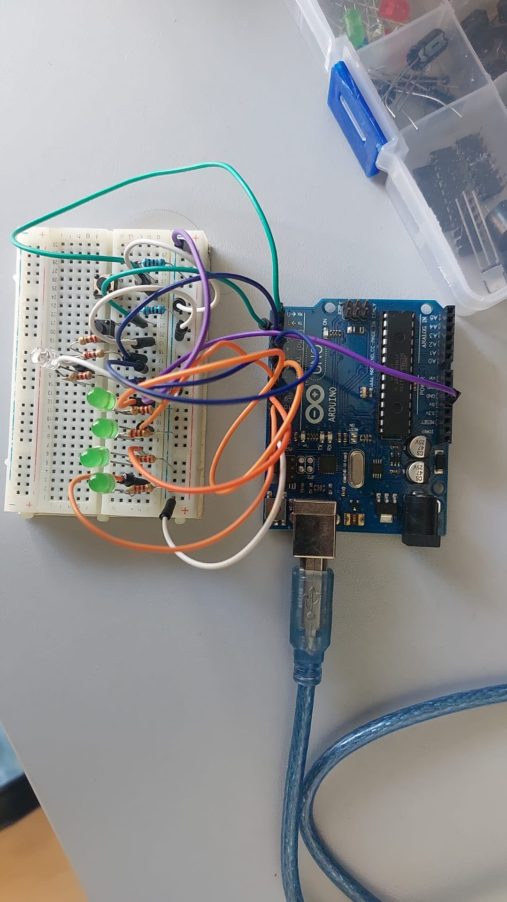
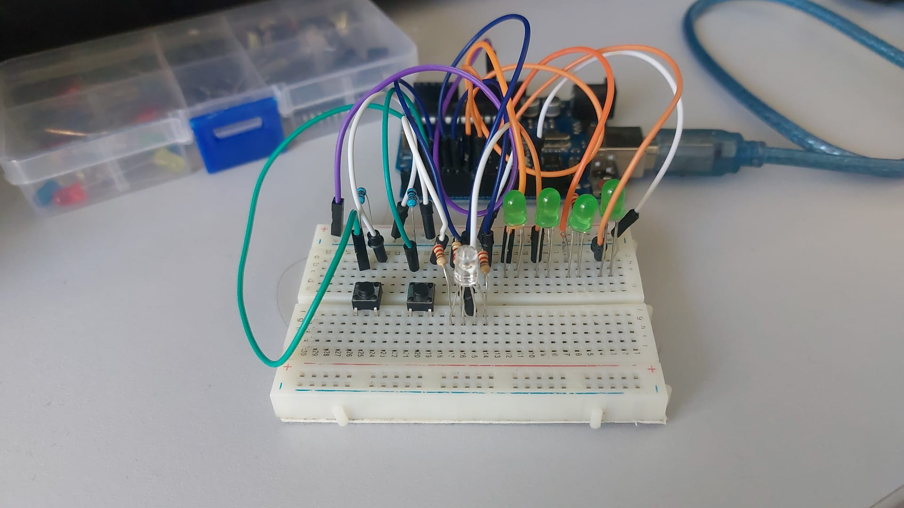
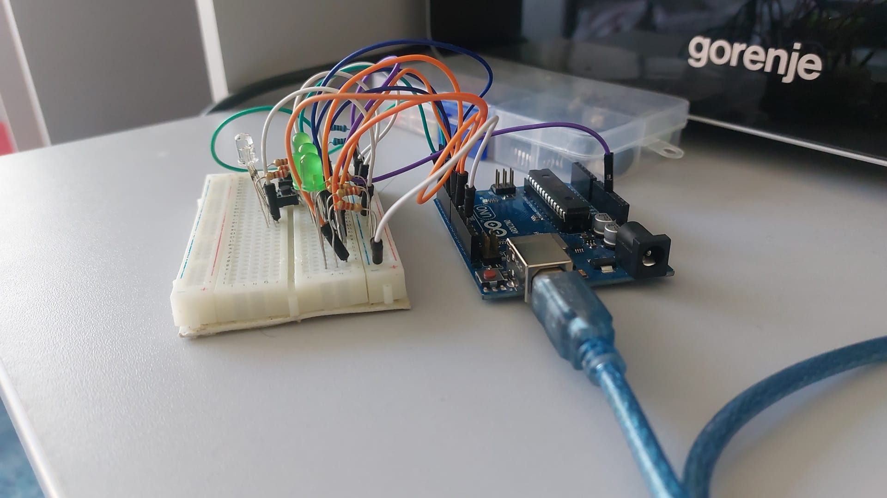
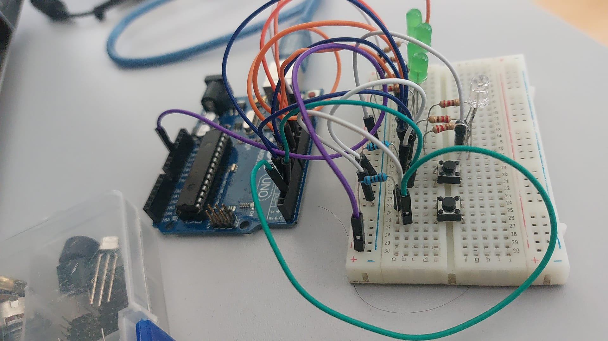
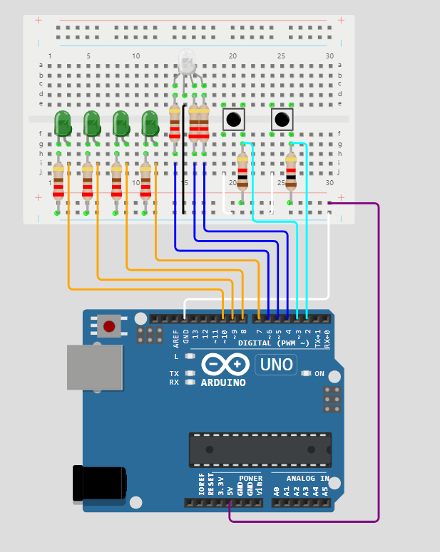

# Robotică

## Descrierea task-ulul
    In aceasta tema am simulat o stiatie de incarcare a vehiculelor elctrice folosind mai multe LED-uri si butoane.

    Statia are 2 stari : libera (verde), ocupata (rosie). Nivelul de incarcare este redat de cele 4 LED-uri, fiecare reprezentand 25%.
Cele doua butoane reprezinta startul unei incarcari respectiv resetarea statiei daca aceasta este in timpul incarcarii, totodata o sa faca LED-urile sa clipeasca de 3 ori.

## Componentele utilizate

-4x LED-uri de culoare verde
    Reprezinta nivelul de incarcare al statiei : 25%, 50%, 75%, 100%
-1x LED RGB
    Reprezinta starea statiei
-2x butoane
    Start: Incepe procesul de incarcare daca statie nu este deja in mijlocul procesului
    Stop: Apasarea lunga reseteaza statia
-7x rezistoare 220ohm
    Pentru Led-uri 
-2x rezistoare 1k ohm
    Pentru butoane
-breadboard
-mai multe fire de legatura

## poze ale setup-ului fizic

## schema electrică

## un link/video cu funcționalitatea montajului fizic

https://www.youtube.com/shorts/YCJ8o43cT_U

