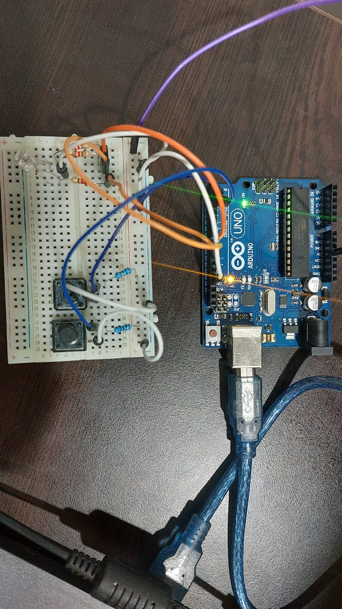
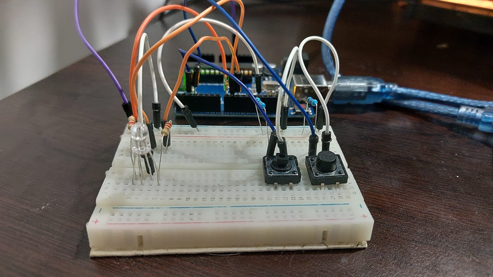
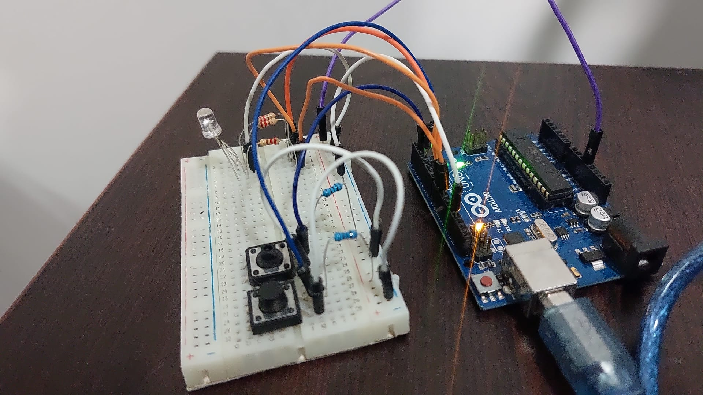
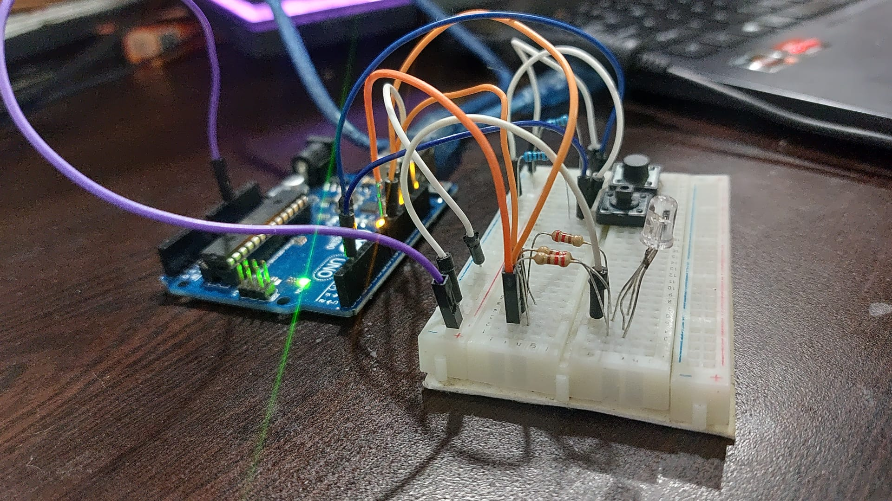
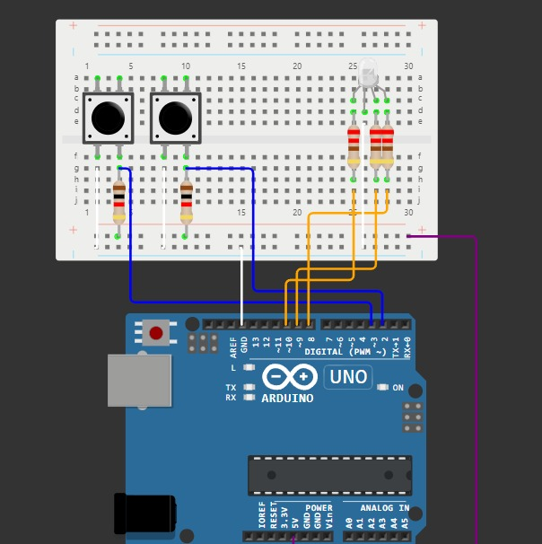

# Robotică

## Descrierea task-ulul

In aceasta tema am reazilat un joc asemanator cu jocul TypeRacer.

Inainte ca jocul sa inceapa trebuie sa selectam dificultatea pe care o alegem. Acest lucru se realizeaza apasand butonul pentru dificultate. De fiecare data cand apasam butonul va aparea un mesaj cu dificultatea pe care suntem, in terminal.
Cand jocul incepe LED-ul RGB lumineaza de 3 ori, semn ca jocul urmeaza sa inceapa. 
LED-ul este verde, dar daca gresim un cuvant acesta se va face rosu. Va ramane rosu pana la urmatoarea scriere corecta a unui cuvant.
La finalul jocului (dupa 30 de secunde) jocul se va termina si se va afisa in terminal cate cuvinte au fost scrise corect.

## Componentele utilizate

* 1x LED RGB - Este folosit pentru a reprezenta daca cuvantul introdus este corect sau gresit
* 2x butoane
* Start-Stop: Incepe sau incheie jocul
* Dificultate: Schimba dificultatea jocului
* 3x rezistoare 220ohm - pentru LED RGB 
* 2x rezistoare 1k ohm - Pentru butoane
* breadboard
* mai multe fire de legatura

## Poze ale setup-ului fizic

## Schema electrică

